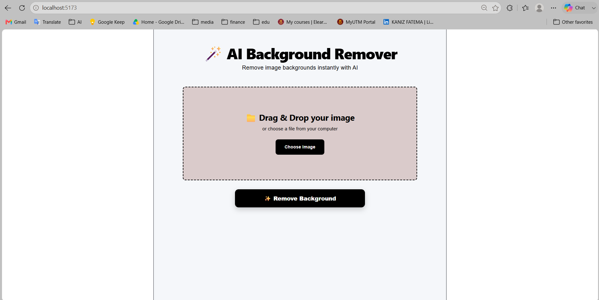
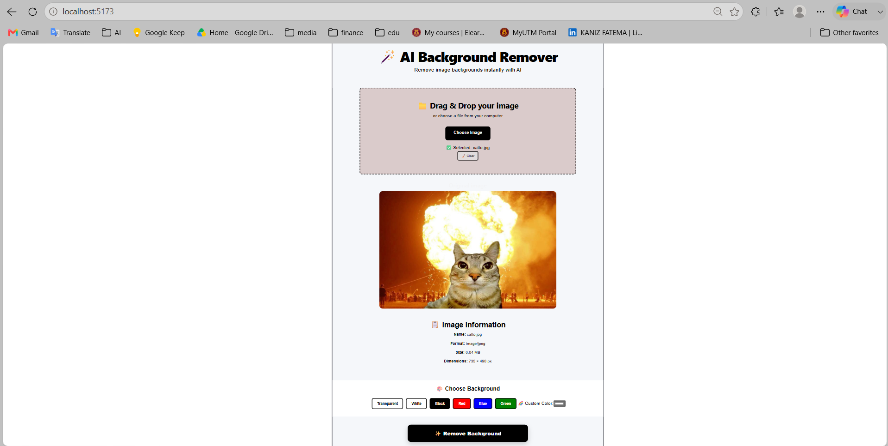
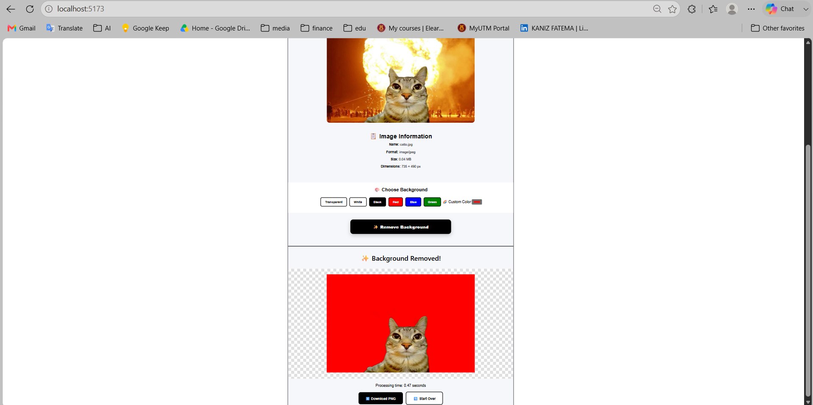
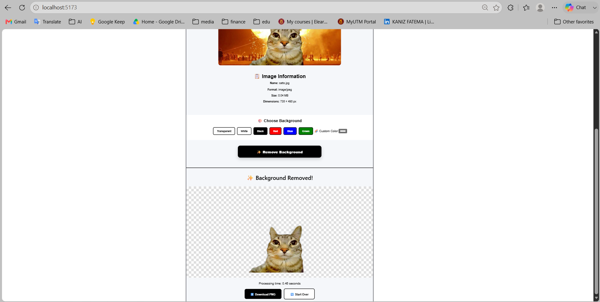

# ✨ AI Background Remover

> A full-stack AI image processing application that automatically removes image backgrounds using AI segmentation and returns a transparent PNG ready for download.


---


## 📸 Screenshots

> project's screenshots are added below to showcase the interface and background removal result.

### Main Interface



### Image Upload



### Background Removal Result(Colorful customised)



### Background Removal Result(Transparent)

---

## 🎥 Demo Video

>  a short demo video is added showing the complete workflow.

**Upload → AI Processing → Background Removed → Download**

[▶️ Watch Demo](https://youtu.be/mrgyjmKdi_A)

---

## 🎯 Project Overview

AI Background Remover is a full-stack web application that allows users to upload an image and automatically remove its background using an AI segmentation model.

The project demonstrates practical experience in:

* Full-stack web development
* AI/ML model integration
* REST API development
* Image processing
* React frontend development
* File validation and handling
* Frontend/backend integration

The application follows a simple workflow:

```text
Upload → Validate → AI Processing → Preview Result → Download PNG
```

---

##  Key Features

*  Drag-and-drop image upload
*  File picker support
*  AI-powered background segmentation
*  FastAPI backend for image processing
*  Client-side file validation
*  Supports JPG, PNG, and WEBP
*  10 MB upload size limit
*  Loading and processing states
*  Processing-time feedback
*  Image metadata display
*  Transparent PNG output
* ⬇ One-click image download
*  Responsive React interface

---

## 🛠️ Tech Stack

### Frontend

* React 19
* Vite
* JavaScript
* CSS
* HTML5 Drag & Drop API

### Backend

* Python
* FastAPI
* Uvicorn
* Pillow
* rembg

### AI / Image Processing

* U2NetP
* AI-based image segmentation
* Background removal
* PNG transparency processing


## 🧠 How It Works

```text
┌──────────────────────┐
│      User Upload     │
│   JPG / PNG / WEBP   │
└──────────┬───────────┘
           │
           ▼
┌──────────────────────┐
│   File Validation    │
│  Type + Size Check   │
└──────────┬───────────┘
           │
           ▼
┌──────────────────────┐
│     FastAPI API      │
│ Multipart Processing │
└──────────┬───────────┘
           │
           ▼
┌──────────────────────┐
│    rembg + U2NetP    │
│   AI Segmentation    │
└──────────┬───────────┘
           │
           ▼
┌──────────────────────┐
│  Transparent PNG     │
│      Generated       │
└──────────┬───────────┘
           │
           ▼
┌──────────────────────┐
│ Preview + Download   │
└──────────────────────┘
```

---

## 🏗️ Architecture

```text
Browser
   │
   │ React + Vite
   ▼
Frontend
   │
   │ POST /api/remove-background
   ▼
Vite Development Proxy
   │
   ▼
FastAPI Backend
   │
   ├── Validate file type
   ├── Validate file size
   ├── Resize image
   │
   ▼
rembg
   │
   ▼
U2NetP AI Segmentation Model
   │
   ▼
Pillow Image Processing
   │
   ▼
PNG Response
   │
   ▼
React Result Preview
```

---

## 📂 Project Structure

```text
ai-background-remover/
│
├── backend/
│   └── main.py
│
├── api/
│   └── index.py
│
├── frontend/
│   ├── src/
│   │   ├── components/
│   │   │   ├── UploadBox.jsx
│   │   │   ├── ImagePreview.jsx
│   │   │   └── ImageInfo.jsx
│   │   │
│   │   ├── App.jsx
│   │   └── App.css
│   │
│   └── vite.config.js
│
├── requirements.txt
├── pic.jpg
└── README.md
```

---

## ⚙️ Run Locally

### 1. Clone the Repository

```bash
git clone https://github.com/KANIZ6228/background-remover.git
cd background-remover
```

### 2. Create a Python Virtual Environment

```powershell
python -m venv venv
.\venv\Scripts\Activate.ps1
```

### 3. Install Backend Dependencies

```powershell
pip install -r requirements.txt
```

### 4. Start FastAPI

From the project root:

```powershell
cd backend
python -m uvicorn main:app --reload --port 8000
```

Backend:

```text
http://127.0.0.1:8000
```

### 5. Start the Frontend

Open a second terminal:

```powershell
cd frontend
npm install
npm run dev
```

Frontend:

```text
http://localhost:5173
```

Keep the FastAPI backend running while using the frontend.

---

## 📦 Production Build

```powershell
cd frontend
npm run build
```

The production build is generated in:

```text
frontend/dist/
```

---

## 🔌 API Documentation

### `POST /remove-background`

Accepts:

```text
multipart/form-data
```

### Request

| Field        | Type  | Required | Description       |
| ------------ | ----- | -------- | ----------------- |
| `file`       | Image | Yes      | JPG, PNG, or WEBP |
| Maximum size | 10 MB | Yes      | Upload size limit |

### Response

The API returns:

```text
image/png
```

The response also includes:

```text
X-Processing-Time
```

which reports the image processing duration in seconds.

### Example

```powershell
curl.exe -X POST http://127.0.0.1:8000/remove-background `
  -F "file=@pic.jpg" `
  --output background-removed.png
```

---

## 💡 Engineering Highlights

### AI Model Initialization

The `u2netp` model session is initialized once instead of being recreated for every request.

This reduces unnecessary model-loading overhead during repeated requests.

### Image Resizing

Uploaded images are resized before AI inference to help control:

* Processing time
* Memory usage
* Computational cost

### File Validation

The application validates uploaded files before processing, including:

* Supported image formats
* Maximum file size
* Invalid upload handling

### Frontend / Backend Separation

The React frontend and FastAPI backend are separated into their own layers, making the application easier to develop, test, and deploy.

### API Integration

The frontend communicates with the backend through a REST API using multipart form-data for image uploads.

---

## 🧩 Challenges & Solutions

| Challenge                                    | Solution                                    |
| -------------------------------------------- | ------------------------------------------- |
| AI model inference can be resource-intensive | Used the lightweight U2NetP model           |
| Large images increase processing cost        | Resize images before inference              |
| Invalid uploads can cause backend errors     | Added file type and size validation         |
| Frontend/backend communication               | Implemented REST API with multipart uploads |
| Different API URLs during development        | Configured Vite `/api` proxy                |
| Model initialization overhead                | Reused the model session                    |


---

## 📊 What I Learned

This project gave me practical experience with:

* Integrating AI models into web applications
* Building REST APIs with FastAPI
* Handling multipart file uploads
* Image processing with Pillow
* React state management
* Frontend/backend integration
* API error handling
* AI inference performance considerations
* Structuring a full-stack application

---

## 🔮 Future Improvements

* Automated backend and frontend testing
* Background job processing for concurrent requests
* Authentication and rate limiting
* CI/CD pipeline
* Batch image processing
* Image processing history
* Cloud storage integration
* Higher-quality segmentation models

---

## 👩‍💻 Author

**Kaniz Fatema**

Computer Science (Software Engineering Student

Universiti Teknologi Malaysia (UTM)
)

**Interests:**
Software Engineering • Full-Stack Development • AI • Automation • Machine Learning

🔗 **GitHub:** [KANIZ6228](https://github.com/KANIZ6228)

🔗 **LinkedIn:** [Kaniz Fatema](https://www.linkedin.com/in/kaniz6228/)

---

## 📄 License

This project is for educational and portfolio purposes.

Review the licenses of `rembg`, its model weights, and any deployment provider before using the project commercially.
